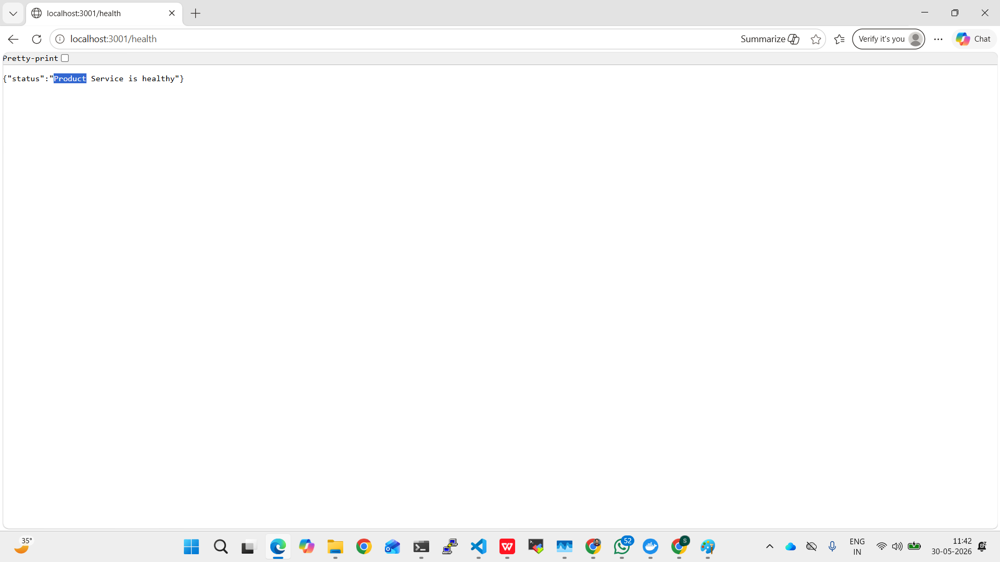
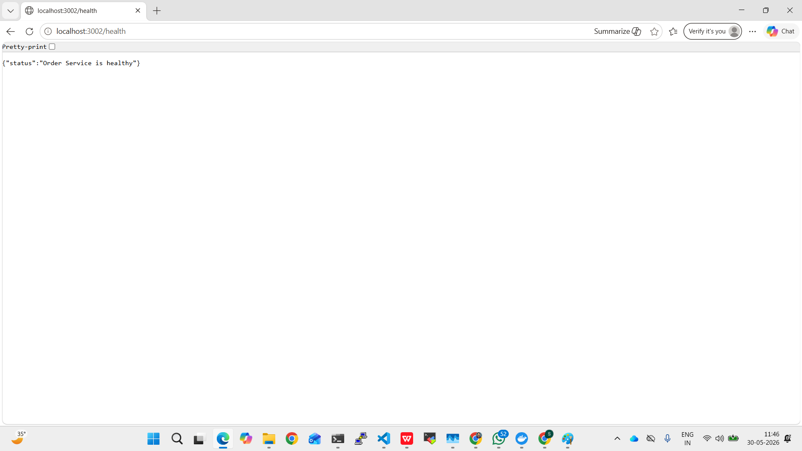
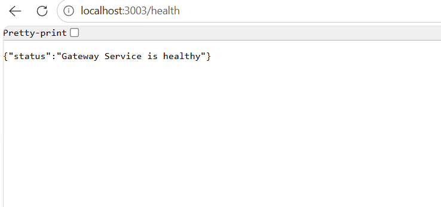

# Microservices-Task

## Overview
This document provides details on testing various services after running the `docker-compose` file. These services include User, Product, Order, and Gateway Services. Each service has its own endpoints for testing purposes.

---

## Dockerfile Setup for Each Service

Each service includes its own `Dockerfile` under its service folder:

- `Microservices/user-service/Dockerfile`
- `Microservices/product-service/Dockerfile`
- `Microservices/order-service/Dockerfile`
- `Microservices/gateway-service/Dockerfile`

Each Dockerfile builds a container image for the service by copying the service code and installing dependencies. The service folders also include `package.json` and `app.js` for the application runtime.

---

## Docker Compose Setup

The `Microservices/docker-compose.yml` file defines the multi-container setup and starts all services together.

The compose file includes:

- `user-service` on port `3000`
- `product-service` on port `3001`
- `order-service` on port `3002`
- `gateway-service` on port `3003`

It builds each service from its folder and connects them in a single network so they can communicate if needed.

---

## Services and Endpoints

### **User Service**
- **Base URL:** `http://localhost:3000`
- **Endpoints:**
  - **List Users:**  
    ```
    curl http://localhost:3000/users
    ```
    Or open in your browser: [http://localhost:3000/users](http://localhost:3000/users)

---

### **Product Service**
- **Base URL:** `http://localhost:3001`
- **Endpoints:**
  - **List Products:**  
    ```
    curl http://localhost:3001/products
    ```
    Or open in your browser: [http://localhost:3001/products](http://localhost:3001/products)

---

### **Order Service**
- **Base URL:** `http://localhost:3002`
- **Endpoints:**
  - **List Orders:**  
    ```
    curl http://localhost:3002/orders
    ```
    Or open in your browser: [http://localhost:3002/orders](http://localhost:3002/orders)

---

### **Gateway Service**
- **Base URL:** `http://localhost:3003/api`
- **Endpoints:**
  - **Users:**  
    ```
    curl http://localhost:3003/api/users
    ```
  - **Products:**  
    ```
    curl http://localhost:3003/api/products
    ```
  - **Orders:**  
    ```
    curl http://localhost:3003/api/orders
    ```

---

## Instructions
1. From the `Microservices` folder, start all services using the `docker-compose` file:
   ```
   cd Microservices
   docker-compose up
   ```
   Optionally run in detached mode:
   ```
   docker-compose up -d
   ```
2. Once the services are running, use the above endpoints to verify the functionality.

Happy testing!

---

## Testing

Use this section to capture and reference screenshots from your service tests.

- `User Service` screenshot
<br>

- `Product Service` screenshot
<br>

- `Order Service` screenshot
<br>

- `Gateway Service` screenshot
<br>
