# Kubernetes Submission Guide

This submission contains Kubernetes manifests for the microservices project, including deployments, services, ingress rules, and health probes for the user, product, order, and gateway services.

## 1. Minikube Setup

### Install Minikube
If Minikube is not already installed, install it using the official instructions for your OS.

For Windows (PowerShell):
```powershell
choco install minikube -y
```
<br>
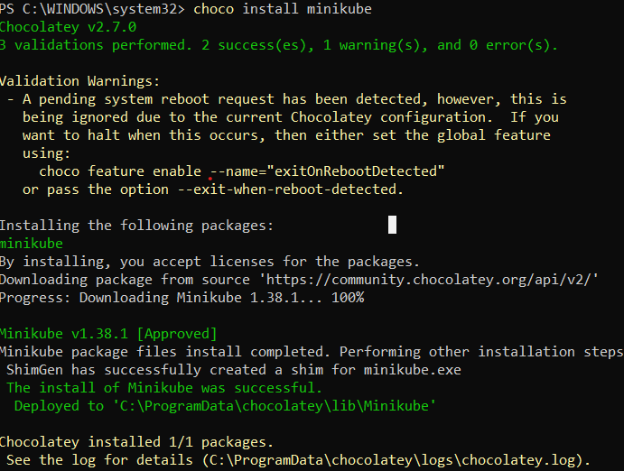
<br>
### Start Minikube
```bash
minikube start
minikube status
```
<br>
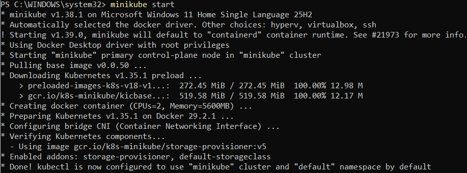
<br>
### Enable Ingress (optional but recommended)
```bash
minikube addons enable ingress
```
<br>
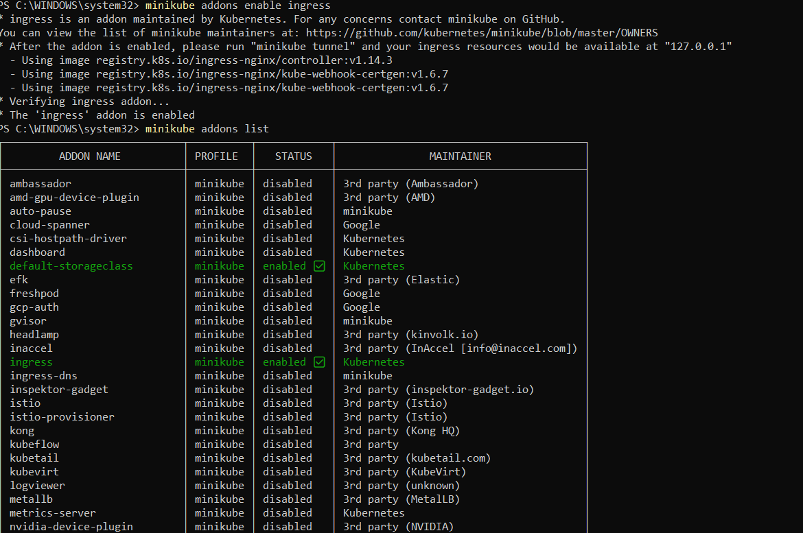
## 2. Build and Load Docker Images
Build the required images from the project root:
```bash
docker build -t microservices-user-service:latest ./Microservices/user-service
docker build -t microservices-product-service:latest ./Microservices/product-service
docker build -t microservices-order-service:latest ./Microservices/order-service
docker build -t microservices-gateway-service:latest ./Microservices/gateway-service
```

Load them into Minikube:
```bash
minikube image load microservices-user-service:latest
minikube image load microservices-product-service:latest
minikube image load microservices-order-service:latest
minikube image load microservices-gateway-service:latest
```

## 3. Deploy to Kubernetes
Apply the manifests from the submission folder:
```bash
kubectl apply -f deployments/
kubectl apply -f services/
kubectl apply -f ingress/
```
<br>
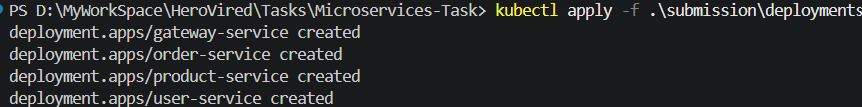
<br>
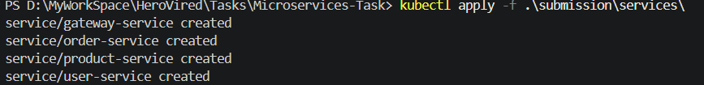
<br>
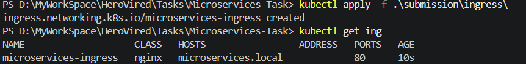
<br>
Verify the resources:
```bash
kubectl get pods
kubectl get svc
kubectl get ingress
```
<br>
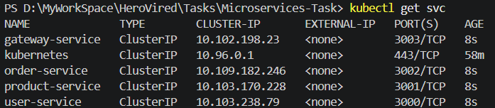
## 4. Test the Services

### Option A: Use kubectl port-forward
Forward a local port to the gateway service:
```bash
kubectl port-forward svc/gateway-service 3003:3003
```

Then test from another terminal:
```bash
curl http://127.0.0.1:3003/health
curl http://127.0.0.1:3003/api/users
curl http://127.0.0.1:3003/api/products
curl http://127.0.0.1:3003/api/orders
```

### Option B: Use the service names internally
You can also test from inside the cluster using a temporary pod:
```bash
kubectl run curl-pod --rm -i --restart=Never --image=curlimages/curl -- sh
```

Then run:
```bash
curl http://gateway-service:3003/health
```

### Option C: Use ingress (if enabled)
```bash
curl http://$(minikube ip)/gateway
```

## 5. Check Logs
```bash
kubectl logs deploy/user-service
kubectl logs deploy/product-service
kubectl logs deploy/order-service
kubectl logs deploy/gateway-service
```
<br>
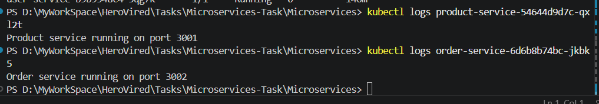
<br>
## 6. Troubleshooting Tips
- Ensure Docker is running before building images.
- If pods are not starting, run:
  ```bash
  kubectl describe pod <pod-name>
  kubectl get events --sort-by=.metadata.creationTimestamp
  ```
- If images are not found, confirm they were loaded into Minikube:
  ```bash
  minikube image ls | findstr microservices
  ```
- If ingress does not work, verify the addon is enabled:
  ```bash
  minikube addons list
  ```
- If port-forwarding fails, check whether the service exists:
  ```bash
  kubectl get svc
  ```

## 7. Required Screenshots For Running Microservices
<br>
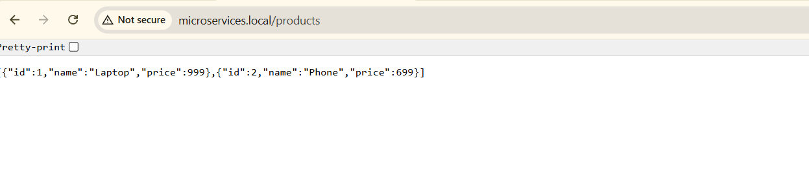
<br>
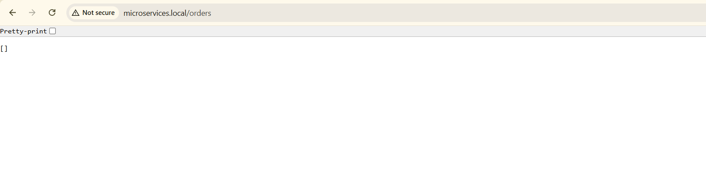
<br>
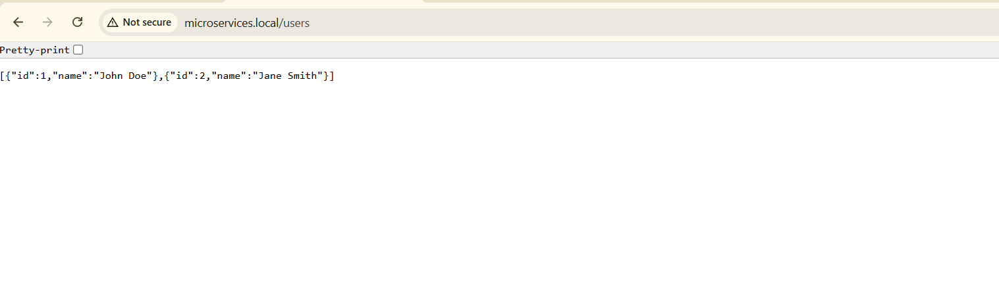